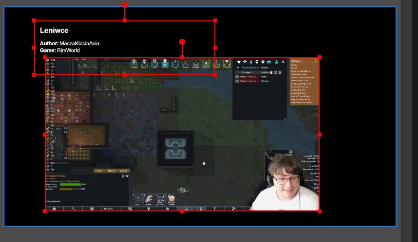

# Random Clip Player
A simple HTML-based Twitch clip player that shows random or top clips from a specific Twitch channel — perfect for break screens on OBS!

## Table of Contents

- [Setup](#setup)
    - [I. Extracting Client ID and Client Secret](#i-extracting-client-id-and-client-secret)
    - [II. Preparing files](#ii-preparing-files)
    - [III. Adding player to OBS](#iii-adding-player-to-obs)
- [Optional functionality](#optional-functionality)
    - [`filter.txt`](#filtertxt)
    - [`aliases.txt`](#aliasestxt)
- [Manual `config.txt` preparation](#manual-configtxt-preparation)
    - [Config options](#config-options)
- [Example configuration files](#example-configuration-files)
    - [`config.txt`](#configtxt)
    - [`aliases.txt`](#aliasestxt-1)
    - [`filter.txt`](#filtertxt-1)
- [Troubleshooting](#troubleshooting)
- [Screenshots](#screenshots)

# Setup
You are required to create a Twitch developer application in order for this to function.
If you have already created one and have the Client ID and Client Secret, skip the `Extracting Client ID and Client Secret` step.

## I. Extracting Client ID and Client Secret
1. Visit [twitch developers page](https://dev.twitch.tv/) and Login.
2. Press "Your Console" in the top right.
3. Under "Applications" press "Register Your Application".
4. Give it any name, it doesn't matter. Select the most appropriate category, or just "Other.".
5. As an "OAuth redirect URL" is required, enter a link to any website - preferably one you own, or just enter a link to [google](https://google.com/). **The app doesn't use this so it's not important.**.
6. Press "Create".
7. Once created, press "Manage" and scroll to the bottom of the page. **Take note of the "Client ID" and "Client Secret"** (press new secret if there isn't one there).

## II. Preparing files

1. Now, download the `clipPlayer.zip` file from [here](https://github.com/ruzaro/RandomClipPlayer/releases/latest). Extract it somewhere accessible.
2. Create the `config.txt` file. It needs to be located next to the other files.
3. Open the `configurator.html` file in your browser. It can be used to fill the `config.txt` file. You can also fill it manually based on the data below.


## III. Adding player to OBS

1. In OBS, add the 'clipPlayer.html' file as a Browser Source. You need to tick "local file" in order for this to be possible.
2. In OBS, adjust the width and height of the Browser Source in the "Properties" panel rather than scaling it, this ensures that the clips play at the highest possible quality without becoming blurry when scaled.
3. You may also want to consider enabling "Shutdown source when not visible" and "Refresh browser when scene becomes active" for the most flexibility.
4. If You want to have a description alongside the player, add the `clipDescription.html` file as a Browser Source similarly to the `clipPlayer.html` file. Adjust the Browser Source settings accordingly.

---
## Optional functionality

### `filter.txt`

You may also add a `filter.txt` file next to other files. Each line in this file will be used to filter clips based on their titles.

### `aliases.txt`

You may also add a `aliases.txt` file next to other files. This file is used to change names that are shown in the description. Format: `<creator_name> = <displayed_name>`

---
## Manual `config.txt` preparation

1. Open the `config.txt` file in a text editor of your choice.
2. Add `CLIENT_ID = `, `CLIENT_SECRET = ` and `BROADCASTER_NAME = ` lines to the `config.txt` file.
3. Enter the Client ID and Client Secret on the `CLIENT_ID = ` and `CLIENT_SECRET = ` lines to the right of `=` respectively.
4. Enter your Twitch username on `BROADCASTER_NAME = ` line to the right of `=`.
5. Add any of the optional configuration lines to the `config.txt` file. Check all possible options down below.
6. Once finished, save and close the `config.txt` file.

### Config options

| Key                | Values           | Required | Default  | Description                                                |
|--------------------|------------------|----------|----------|------------------------------------------------------------|
| CLIENT_ID          | Client ID        | ✅        | -        | "Client ID" retrieved from https://dev.twitch.tv/          |
| CLIENT_SECRET      | Client Secret    | ✅        | -        | "Client Secret" retrieved from https://dev.twitch.tv/      |
| BROADCASTER_NAME   | Broadcaster name | ✅        | -        | Your Twitch channel name                                   |
| TOP_OR_RANDOM      | `top`/`random`   | ❌        | `random` | Choose whether to prefer top clips or randomly picked ones |
| VOLUME_PERCENT     | `0` to `100`     | ❌        | `50`     | Volume level for playback                                  |
| SHOW_CLIP_CREATORS | `true`/`false`   | ❌        | `true`   | Display the clip creator name                              |
| SHOW_CLIP_GAME     | `true`/`false`   | ❌        | `true`   | Display the game associated with the clip                  |
| SHOW_CLIP_TITLE    | `true`/`false`   | ❌        | `true`   | Display the title of the clip                              |
| MAX_CLIPS          | number           | ❌        | `1000`   | Number of clips stored in memory                           |
| DESC_AUTHOR_PREFIX | text             | ❌        | -        | 	Optional text prefix before the author name               |
| DESC_GAME_PREFIX   | text             | ❌        | -        | Optional text prefix before the game title                 |

## Example configuration files

### config.txt

```
CLIENT_ID = 12345coolclientid
CLIENT_SECRET = 54321ihatejs
BROADCASTER_NAME = Szafer128
TOP_OR_RANDOM = random
VOLUME_PERCENT = 50
SHOW_CLIP_CREATORS = true
SHOW_CLIP_GAME = true
SHOW_CLIP_TITLE = true
MAX_CLIPS = 2000
DESC_AUTHOR_PREFIX = Author:
DESC_GAME_PREFIX = Game:
```

### aliases.txt

```
CoolViewer123 = VeryCoolViewer
SuperChatGuy420 = IDontLikeThisGuy
___W31RD_N4M3___ = Casual Name :)
```

### filter.txt

```
!dc
!yt
hate
bad
```

## Troubleshooting

### Nothing plays in OBS
- Make sure the `clipPlayer.html` file is added as a **local file** in the Browser Source settings.
- Confirm that `config.txt` exists and is placed in the **same folder** as `clipPlayer.html`.
- Double-check `CLIENT_ID`, `CLIENT_SECRET`, and `BROADCASTER_NAME` in your `config.txt`.
- Open `clipPlayer.html` in a browser directly (outside OBS) to see if any errors appear in the console (`F12` → Console tab).

---

### Clips are blurry or low resolution
- In OBS, **don’t scale** the browser source manually.
- Instead, set the exact **resolution** in the Browser Source properties (e.g., 1920x1080).
- Ensure Twitch clips themselves are of good quality — old or low-view clips may be blurry.

---

### Clips don’t change / stuck on one clip
- Enable “**Refresh browser when scene becomes active**” in Browser Source settings.
- Try switching between `TOP_OR_RANDOM = top` and `random` to see if it changes behavior.
- Try clearing the cache: delete the `clips.json` or similar stored data (if applicable).

---

### OBS shows a white or black box
- This usually means a JavaScript error or the file couldn't be loaded.
- Open `clipPlayer.html` in your browser and press `F12` to check for any JavaScript errors.
- Make sure you're not missing any required files (`config.txt`, etc.).
- Check that your antivirus or Windows Defender isn’t blocking local HTML access.

---

### Twitch authentication fails
- Ensure the `CLIENT_ID` and `CLIENT_SECRET` are copied correctly — no extra spaces.
- Make sure your Twitch app is still valid (check the developer console).
- Try generating a new Client Secret if it seems invalid.

---

### No sound from clips
- OBS browser sources are sometimes muted by default. Right-click the source → **Properties** → check the audio monitoring setting.
- Check `VOLUME_PERCENT` in `config.txt` and increase it (e.g., to 80).
- Make sure your OBS Audio settings include Browser Source output.

---

### Filters not working (filter.txt)
- Remember: `filter.txt` is **case-sensitive**.
- It blocks clips that contain **any** of the listed words/phrases in the **title**.
- Use one filter per line, no commas.

---

### Clip descriptions don’t match expected names
- Check your `aliases.txt` file formatting. It should be: `original_name = custom_display_name`
- Make sure there are no extra spaces or tabs.


## Screenshots

### 



[Go to top](#table-of-contents)