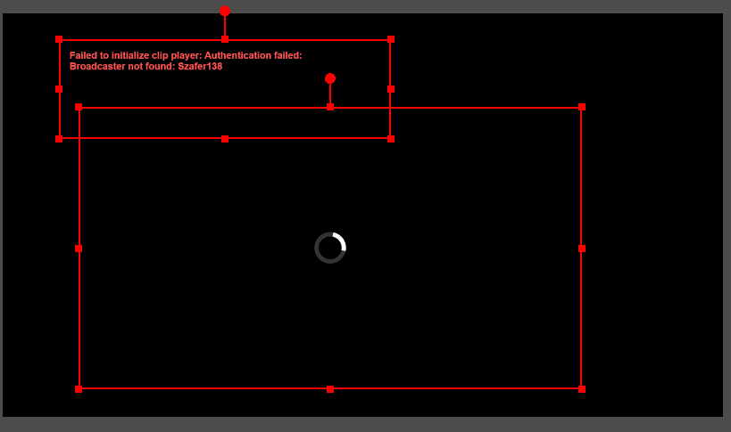

# Random Clip Player


A simple tool that shows random clips from your Twitch channel in OBS. 
Perfect for stream starting soon, break, or BRB screens!

**No coding knowledge required!** Just follow the simple setup steps below.

## Table of Contents

- [Setup](#quick-setup-guide)
    - [Requirements](#what-youll-need)
    - [Download the Files](#step-1-download-the-files)
    - [Get Your Twitch API Keys](#step-2-get-your-twitch-api-keys)
    - [Set Up Your Configuration](#step-3-set-up-your-configuration)
    - [Add to OBS](#step-4-add-to-obs)
- [Optional functionality](#optional-functionality)
    - [`filter.txt`](#filtertxt)
    - [`aliases.txt`](#aliasestxt)
- [Manual `config.txt` preparation](#manual-configtxt-preparation)
    - [Config options](#config-options)
- [Example configuration files](#example-configuration-files)
    - [`config.txt`](#configtxt)
    - [`aliases.txt`](#aliasestxt-1)
    - [`filter.txt`](#filtertxt-1)
- [Common Issues & Solutions](#common-issues--solutions)
- [Frequently Asked Questions](#frequently-asked-questions)
- [Screenshots](#screenshots)
- [Important Note About Twitch API Stability](#important-note-about-twitch-api-stability)

## Quick Setup Guide
You are required to create a Twitch developer application in order for this to function.
If you have already created one and have the Client ID and Client Secret, skip the `Extracting Client ID and Client Secret` step.

### What You'll Need
- OBS Studio installed on your computer
- A Twitch account
- 5-10 minutes of your time

### Step 1: Download the Files
1. Download the latest `clipPlayer.zip` from [here](https://github.com/ruzaro/RandomClipPlayer/releases/latest)
2. Extract all files to a folder on your computer
3. Remember where you saved these files - you'll need them later!

### Step 2: Get Your Twitch API Keys
1. Go to [dev.twitch.tv](https://dev.twitch.tv/) and log in with your Twitch account
2. Click "Your Console" in the top right
3. Click "Register Your Application"
4. Fill in the form:
  - **Name**: Random Clip Player (or any name you prefer)
  - **Category**: Choose "Website Integration" or "Other"
  - **OAuth Redirect URL**: Just type `https://localhost` (this won't be used)
5. Click "Create"
6. On the next page, click "Manage"
7. Copy your **Client ID**
8. Click "New Secret", then copy your **Client Secret**
  - ⚠️ **Important**: Save these somewhere safe! You'll need them in the next step.

### Step 3: Set Up Your Configuration
0. You can also fill the `config.txt` file manually based on the information below (Not recommended).
1. Open the `configurator.html` file in your web browser
2. Fill in the required information:
  - **Client ID**: Paste your Client ID from Step 2
  - **Client Secret**: Paste your Client Secret from Step 2
  - **Twitch Channel Name**: Your Twitch username
3. Adjust any other settings as desired
4. Click "Select config.txt" to save your settings

### Step 4: Add to OBS
1. Open OBS Studio
2. In your scene, right-click and select "Add" → "Browser"
3. Check the "Local file" box
4. Click "Browse" and select the `clipPlayer.html` file
5. Set Width and Height to match your canvas (e.g., 1920×1080). This ensures that the clips play at the highest possible quality without becoming blurry when scaled
6. You may also want to consider enabling "Shutdown source when not visible" and "Refresh browser when scene becomes active" for the most flexibility.
7. Click "OK"
8. If You want to have a description alongside the player, add the `clipDescription.html` file as a Browser Source similarly to the `clipPlayer.html` file. Adjust the Browser Source settings accordingly.

That's it! Your Random Clip Player is now set up and ready to use.

---
## Optional functionality

### `filter.txt`

You may also add a `filter.txt` file next to other files. Each line in this file will be used to filter clips based on their titles.

### `aliases.txt`

You may also add a `aliases.txt` file next to other files. This file is used to change names that are shown in the description. Format: `<creator_name> = <displayed_name>`

---
## Manual `config.txt` preparation

1. Open the `config.txt` file in a text editor of your choice.
2. Add `CLIENT_ID = `, `CLIENT_SECRET = ` and `BROADCASTER_NAME = ` lines to the `config.txt` file.
3. Enter the Client ID and Client Secret on the `CLIENT_ID = ` and `CLIENT_SECRET = ` lines to the right of `=` respectively.
4. Enter your Twitch username on `BROADCASTER_NAME = ` line to the right of `=`.
5. Add any of the optional configuration lines to the `config.txt` file. Check all possible options down below.
6. Once finished, save and close the `config.txt` file.

### Config options

| Key                | Values           | Required | Default  | Description                                                |
|--------------------|------------------|----------|----------|------------------------------------------------------------|
| CLIENT_ID          | Client ID        | ✅        | -        | "Client ID" retrieved from https://dev.twitch.tv/          |
| CLIENT_SECRET      | Client Secret    | ✅        | -        | "Client Secret" retrieved from https://dev.twitch.tv/      |
| BROADCASTER_NAME   | Broadcaster name | ✅        | -        | Your Twitch channel name                                   |
| TOP_OR_RANDOM      | `top`/`random`   | ❌        | `random` | Choose whether to prefer top clips or randomly picked ones |
| VOLUME_PERCENT     | `0` to `100`     | ❌        | `50`     | Volume level for playback                                  |
| SHOW_CLIP_CREATORS | `true`/`false`   | ❌        | `true`   | Display the clip creator name                              |
| SHOW_CLIP_GAME     | `true`/`false`   | ❌        | `true`   | Display the game associated with the clip                  |
| SHOW_CLIP_TITLE    | `true`/`false`   | ❌        | `true`   | Display the title of the clip                              |
| MAX_CLIPS          | number           | ❌        | `1000`   | Number of clips stored in memory                           |
| DESC_AUTHOR_PREFIX | text             | ❌        | -        | 	Optional text prefix before the author name               |
| DESC_GAME_PREFIX   | text             | ❌        | -        | Optional text prefix before the game title                 |

## Example configuration files

### config.txt

```
CLIENT_ID = 12345coolclientid
CLIENT_SECRET = 54321ihatejs
BROADCASTER_NAME = Szafer128
TOP_OR_RANDOM = random
VOLUME_PERCENT = 50
SHOW_CLIP_CREATORS = true
SHOW_CLIP_GAME = true
SHOW_CLIP_TITLE = true
MAX_CLIPS = 2000
DESC_AUTHOR_PREFIX = Author:
DESC_GAME_PREFIX = Game:
```

### aliases.txt

```
CoolViewer123 = VeryCoolViewer
SuperChatGuy420 = IDontLikeThisGuy
___W31RD_N4M3___ = Casual Name :)
```

### filter.txt

```
!dc
!yt
hate
bad
```

## Common Issues & Solutions

### If You See an Error Message



This usually means one of these problems:

#### "Authentication failed" or "Failed to get OAuth token"
- Double-check your Client ID and Client Secret in the config.txt file
- Make sure there are no extra spaces before or after the values
- Try generating a new Client Secret from the Twitch Developer Console

#### "No clips available"
- Make sure your channel has clips created
- Try changing from "random" to "top" in your settings
- Check if your filter.txt is blocking too many clips

#### "Failed to get clip info" or "Failed to get clip links"
- This is usually a temporary issue with Twitch's servers
- The player will automatically try to play a different clip
- If this happens frequently, please check the note about Twitch API issues below

---

### Nothing plays in OBS
- Make sure the `clipPlayer.html` file is added as a **local file** in the Browser Source settings.
- Confirm that `config.txt` exists and is placed in the **same folder** as `clipPlayer.html`.
- Double-check `CLIENT_ID`, `CLIENT_SECRET`, and `BROADCASTER_NAME` in your `config.txt`.
- Open `clipPlayer.html` in a browser directly (outside OBS) to see if any errors appear in the console (`F12` → Console tab).

---

### Clips are blurry or low resolution
- In OBS, **don’t scale** the browser source manually.
- Instead, set the exact **resolution** in the Browser Source properties (e.g., 1920x1080).
- Ensure Twitch clips themselves are of good quality — old or low-view clips may be blurry.

---

### Clips don’t change / stuck on one clip
- Enable “**Refresh browser when scene becomes active**” in Browser Source settings.
- Try switching between `TOP_OR_RANDOM = top` and `random` to see if it changes behavior.
- Try clearing the cache: delete the `clips.json` or similar stored data (if applicable).

---

### OBS shows a white or black box
- This usually means a JavaScript error or the file couldn't be loaded.
- Open `clipPlayer.html` in your browser and press `F12` to check for any JavaScript errors.
- Make sure you're not missing any required files (`config.txt`, etc.).
- Check that your antivirus or Windows Defender isn’t blocking local HTML access.

---

### Twitch authentication fails
- Ensure the `CLIENT_ID` and `CLIENT_SECRET` are copied correctly — no extra spaces.
- Make sure your Twitch app is still valid (check the developer console).
- Try generating a new Client Secret if it seems invalid.

---

### No sound from clips
- OBS browser sources are sometimes muted by default. Right-click the source → **Properties** → check the audio monitoring setting.
- Check `VOLUME_PERCENT` in `config.txt` and increase it (e.g., to 80).
- Make sure your OBS Audio settings include Browser Source output.

---

### Filters not working (filter.txt)
- Remember: `filter.txt` is **case-sensitive**.
- It blocks clips that contain **any** of the listed words/phrases in the **title**.
- Use one filter per line, no commas.

---

### Clip descriptions don’t match expected names
- Check your `aliases.txt` file formatting. It should be: `original_name = custom_display_name`
- Make sure there are no extra spaces or tabs.


## Frequently Asked Questions

### How do I change which clips are shown?
Use the `TOP_OR_RANDOM` setting in the configurator:
- `random` shows a variety of clips (recommended)
- `top` shows only the most popular clips

### How do I block clips with certain words in the title?
Create a file named `filter.txt` in the same folder as the other files. Add one word or phrase per line that you want to block.

### How do I change how creator names are displayed?
Create a file named `aliases.txt` in the same folder. Use the format: `original_name = display_name`

### Can I use this with multiple Twitch channels?
Currently, you can only show clips from one channel at a time. Create separate configurations for different channels.

### Why are some clips blurry?
Make sure to set the exact resolution in OBS Browser Source properties rather than scaling the source.

## Screenshots

### 


## Important Note About Twitch API Stability

The Random Clip Player relies on Twitch's API services, which occasionally experience issues:

- **What might happen**: Sometimes clips may fail to load or the player might show an error message
- **Why this happens**: Twitch occasionally changes how their API works or experiences temporary outages
- **What you'll see**: If this happens, you'll see an error message displayed on screen
- **What to do**: Usually, just wait a few minutes and the player will automatically try again with different clips

**Good news**: The player is designed to handle these issues automatically by:
- Showing clear error messages when problems occur
- Automatically retrying with different clips
- Continuing to work when the service is restored

If you see persistent errors for more than a day, check [the GitHub page](https://github.com/ruzaro/RandomClipPlayer/issues) for any announcements about API changes or updates to the player.

[Go to top](#table-of-contents)